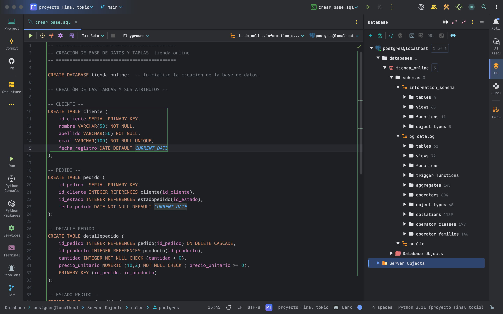

Creación de la Base de Datos
============================

En esta sección se documenta el diseño lógico y físico de la base de datos del proyecto Tienda Online. El diseño parte del modelo E/R y culmina en la creación del esquema relacional en PostgreSQL.

Modelo relacional derivado
--------------------------

El modelo entidad-relación ha sido traducido a un conjunto de tablas que representan entidades y relaciones. Las principales tablas del sistema son:

- `cliente`
- `producto`
- `categoria`
- `proveedor`
- `pedido`
- `detallepedido`
- `estadopedido`

Cada tabla ha sido diseñada respetando las formas normales hasta la **3FN**, lo que garantiza:

- Ausencia de redundancia.
- Dependencias funcionales claras.
- Integridad referencial sólida.

Esquema SQL generado (`crear_base.sql`)
----------------------------------------

A continuación, se detalla la creación de las tablas principales.

**Tabla `cliente`**

.. code-block:: postgresql

    CREATE TABLE cliente (
        id_cliente SERIAL PRIMARY KEY,
        nombre VARCHAR(50) NOT NULL,
        apellido VARCHAR(50) NOT NULL,
        email VARCHAR(100) NOT NULL UNIQUE,
        fecha_registro DATE DEFAULT CURRENT_DATE);

**Tabla `categoria`**

.. code-block:: postgresql

    CREATE TABLE categoria (
        id_categoria SERIAL PRIMARY KEY,
        nombre_categoria VARCHAR(100) NOT NULL UNIQUE);

**Tabla `proveedor`**

.. code-block:: postgresql

    CREATE TABLE proveedor (
        id_proveedor SERIAL PRIMARY KEY,
        nombre_empresa VARCHAR(100) NOT NULL,
        telefono VARCHAR(20),
        email VARCHAR(100) UNIQUE);

**Tabla `producto`**

.. code-block:: postgresql

    CREATE TABLE producto (
        id_producto SERIAL PRIMARY KEY,
        nombre VARCHAR(100) NOT NULL,
        descripcion TEXT,
        precio_unitario NUMERIC(10,2) NOT NULL,
        stock INTEGER NOT NULL CHECK (stock >= 0),
        id_categoria INTEGER REFERENCES categoria(id_categoria),
        id_proveedor INTEGER REFERENCES proveedor(id_proveedor));

**Tabla `estadopedido`**

.. code-block:: postgresql

    CREATE TABLE estadopedido (
        id_estado SERIAL PRIMARY KEY,
        nombre_estado VARCHAR(50) NOT NULL UNIQUE);

**Tabla `pedido`**

.. code-block:: postgresql

    CREATE TABLE pedido (
        id_pedido SERIAL PRIMARY KEY,
        id_cliente INTEGER REFERENCES cliente(id_cliente),
        fecha_pedido DATE DEFAULT CURRENT_DATE,
        id_estado INTEGER REFERENCES estadopedido(id_estado));

**Tabla `detallepedido`**

.. code-block:: postgresql

    CREATE TABLE detallepedido (
        id_pedido INTEGER REFERENCES pedido(id_pedido),
        id_producto INTEGER REFERENCES producto(id_producto),
        cantidad INTEGER NOT NULL CHECK (cantidad > 0),
        precio_unitario NUMERIC(10,2) NOT NULL,
        PRIMARY KEY (id_pedido, id_producto));

Imagen que documenta la creación de la BD y sus tablas
~~~~~~~~~~~~~~~~~~~~~~~~~~~~~~~~~~~~~~~~~~~~~~~~~~~~~~

Relaciones y claves foráneas

Cada producto está asociado a una categoría y un proveedor.
Cada pedido pertenece a un cliente y tiene un estado.
La tabla detallepedido modela una relación muchos-a-muchos entre productos y pedidos, con información adicional como cantidad y precio.
Consideraciones de diseño

Se han definido restricciones de integridad (NOT NULL, UNIQUE, CHECK) para garantizar la validez de los datos.
Se han incluido claves primarias y foráneas para establecer las relaciones entre tablas.
La estructura está normalizada hasta 3FN, eliminando dependencias transitivas y redundancias.
Este esquema sienta las bases para el resto de funcionalidades implementadas a lo largo del proyecto.