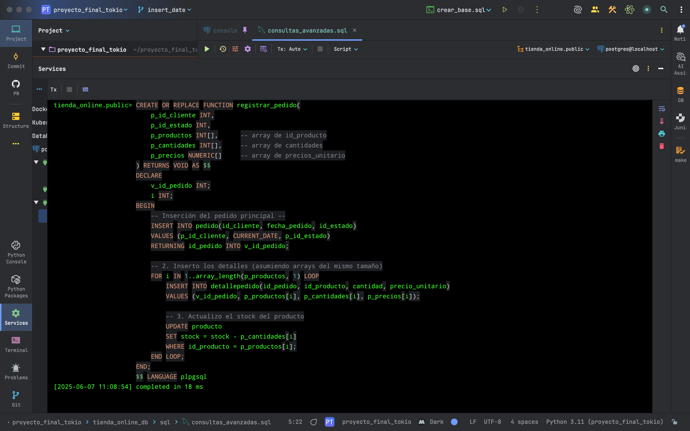
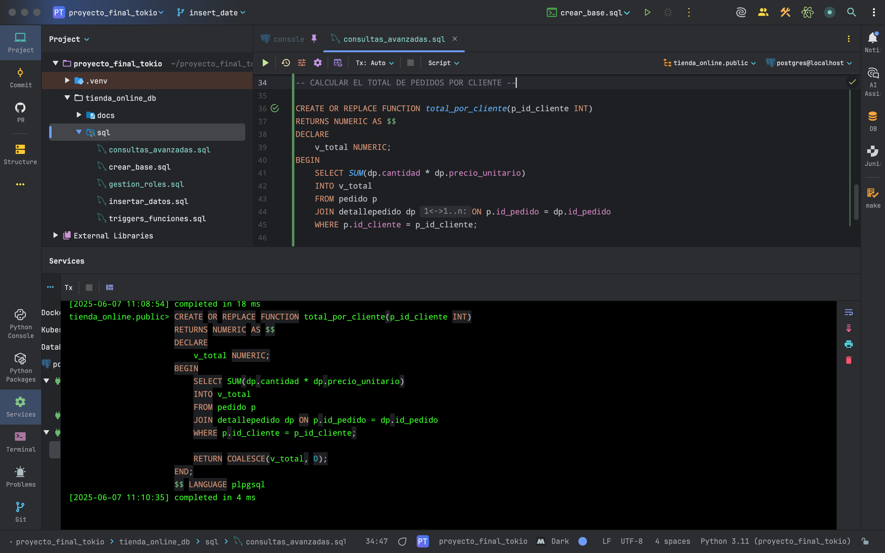
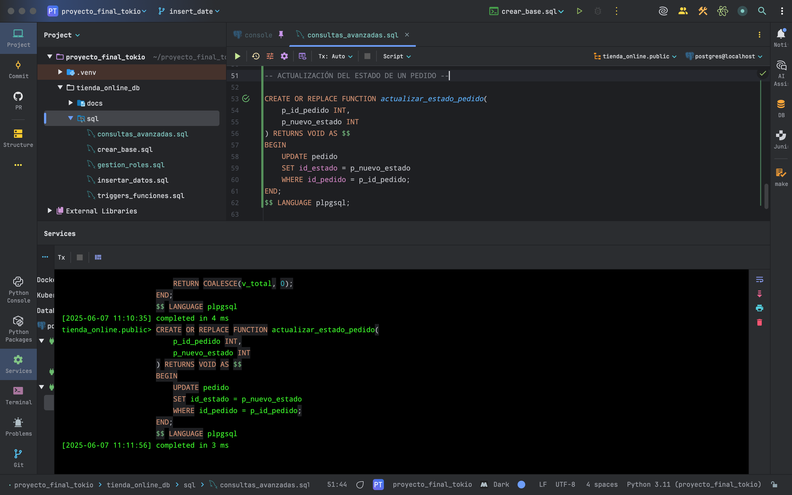
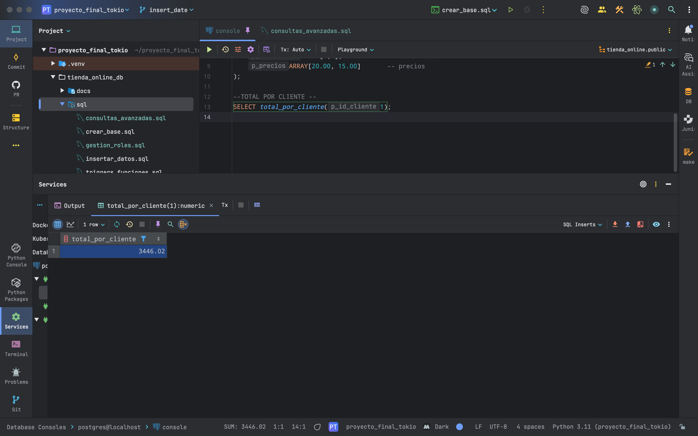
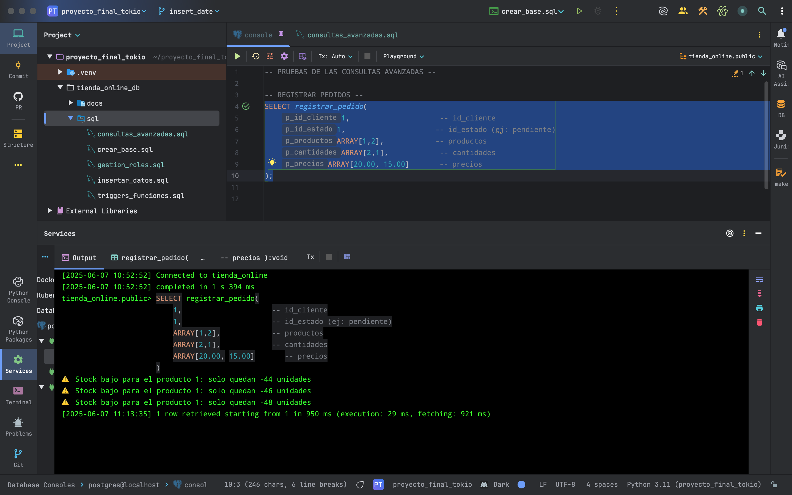
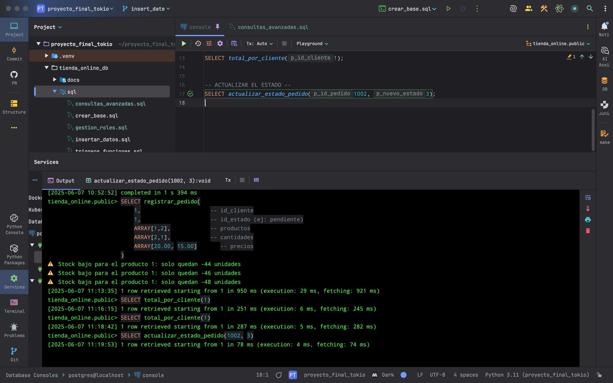

========================================
FUNCIONES EN PL/pgSQL
========================================

En esta sección se documentan las funciones programadas en el lenguaje procedural PL/pgSQL, utilizadas para encapsular lógica del negocio en la base de datos `tienda_online`.

Se implementaron tres funciones principales:

1. Registrar un nuevo pedido.
2. Calcular el total gastado por un cliente.
3. Actualizar el estado de un pedido.

1. Función: registrar_pedido
----------------------------

Registra un pedido completo, incluyendo su detalle, en una transacción controlada.

.. code-block:: postgresql

    CREATE OR REPLACE FUNCTION registrar_pedido(
        p_id_cliente INTEGER,
        p_id_estado INTEGER,
        p_id_producto INTEGER,
        p_cantidad INTEGER
    ) RETURNS VOID AS $$
    DECLARE
        v_precio NUMERIC;
        v_id_pedido INTEGER;
    BEGIN
        -- Obtener precio del producto
        SELECT precio_unitario INTO v_precio
        FROM producto
        WHERE id_producto = p_id_producto;

        -- Crear el pedido
        INSERT INTO pedido (id_cliente, id_estado, fecha_pedido)
        VALUES (p_id_cliente, p_id_estado, CURRENT_DATE)
        RETURNING id_pedido INTO v_id_pedido;

        -- Insertar línea de detalle
        INSERT INTO detallepedido (id_pedido, id_producto, cantidad, precio_unitario)
        VALUES (v_id_pedido, p_id_producto, p_cantidad, v_precio);
    END;
    $$ LANGUAGE plpgsql;

Ejecución de la función `registrar_pedido` (con bucle for)
~~~~~~~~~~~~~~~~~~~~~~~~~~~~~~~~~~~~~~~~~~~~~~~~~~~~~~

La siguiente imagen muestra la ejecución de la función `registrar_pedido`, que inserta el pedido, sus detalles, y actualiza el stock de los productos usando un bucle `FOR`:

2. Función: calcular_total_por_cliente
--------------------------------------

Calcula cuánto ha gastado un cliente en total.

.. code-block:: postgresql

    CREATE OR REPLACE FUNCTION calcular_total_por_cliente(
        p_id_cliente INTEGER
    ) RETURNS NUMERIC AS $$
    DECLARE
        v_total NUMERIC;
    BEGIN
        SELECT SUM(dp.cantidad * dp.precio_unitario)
        INTO v_total
        FROM pedido p
        JOIN detallepedido dp ON p.id_pedido = dp.id_pedido
        WHERE p.id_cliente = p_id_cliente;

        RETURN COALESCE(v_total, 0);
    END;
    $$ LANGUAGE plpgsql;

Lógica y ejecución de `total_por_cliente`
~~~~~~~~~~~~~~~~~~~~~~~~~~~~~~~~~~~~~~~~

3. Función: actualizar_estado_pedido
------------------------------------

Permite cambiar el estado de un pedido a un nuevo valor.

.. code-block:: postgresql

    CREATE OR REPLACE FUNCTION actualizar_estado_pedido(
        p_id_pedido INTEGER,
        p_nuevo_estado INTEGER
    ) RETURNS VOID AS $$
    BEGIN
        UPDATE pedido
        SET id_estado = p_nuevo_estado
        WHERE id_pedido = p_id_pedido;
    END;
    $$ LANGUAGE plpgsql;

Lógica y ejecución de `actualizar_estado_pedido`
~~~~~~~~~~~~~~~~~~~~~~~~~~~~~~~~~~~~~~~~~~~~~~~

Resultado total acumulado por cliente
~~~~~~~~~~~~~~~~~~~~~~~~~~~~~~~~~~~~~

Validación completa de `registrar_pedido`
~~~~~~~~~~~~~~~~~~~~~~~~~~~~~~~~~~~~~~~~

La siguiente imagen muestra la ejecución integrada de la función `registrar_pedido`, incluyendo alertas de stock bajo y validación de estados.

Consulta combinada: stock bajo + actualización de estado
~~~~~~~~~~~~~~~~~~~~~~~~~~~~~~~~~~~~~~~~~~~~~~~~~~~~~~~~

Validación y pruebas
--------------------

- Se realizaron pruebas unitarias de cada función.
- Se insertaron pedidos completos desde la función `registrar_pedido`.
- Se validaron resultados con consultas posteriores.
- Se controlaron posibles errores como productos inexistentes o cantidades inválidas (se recomienda agregar validaciones en versiones futuras).

Estas funciones encapsulan lógica clave del negocio, asegurando integridad, consistencia y reutilización dentro del sistema.
