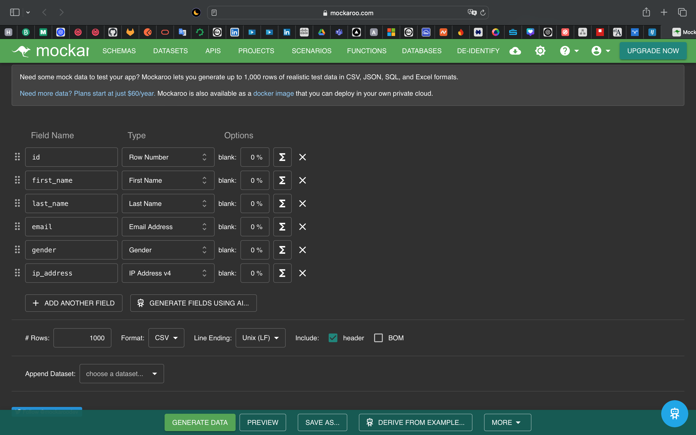
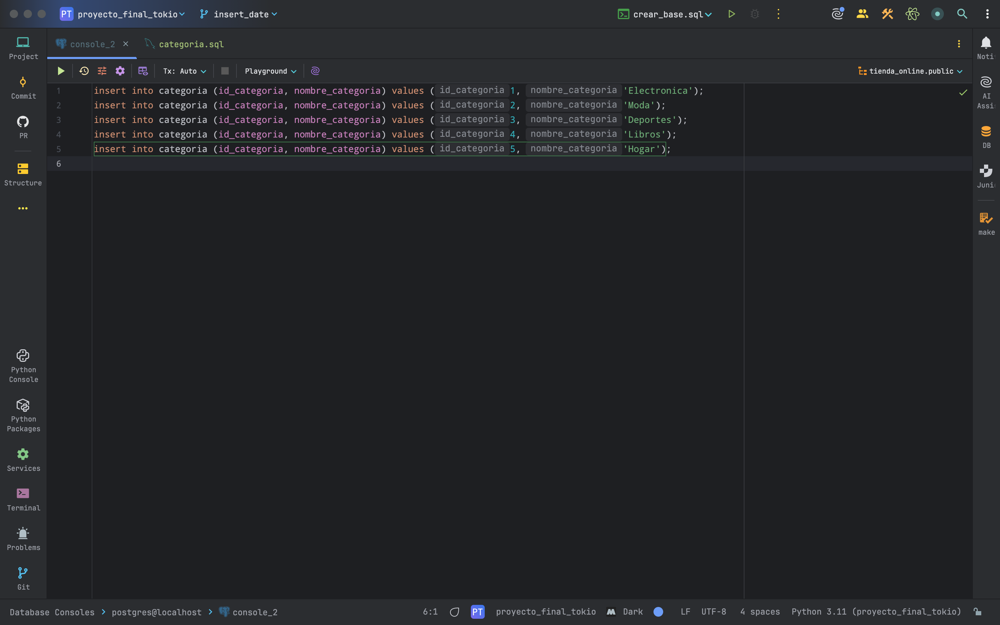

=========================================================
CARGA DE DATOS SINTÉTICOS Y ORGÁNICOS (Mockaroo + Manual)
=========================================================

Objetivo de esta fase:
----------------------
Insertar datos en todas las tablas del modelo `tienda_online`, usando dos enfoques:

1. **Carga Sintética** con Mockaroo (datos generados artificialmente).
2. **Carga Orgánica** manual para pruebas controladas.

1. Carga de Datos Sintéticos con Mockaroo
-----------------------------------------

Mockaroo configurando categorías
~~~~~~~~~~~~~~~~~~~~~~~~~~~~~~~~

Herramienta usada: https://www.mockaroo.com/

Tablas generadas:

- estadopedido.sql → 3 estados
- categoria.sql → 5 categorías
- proveedor.sql → 5 proveedores
- cliente.sql → 50 clientes
- producto.sql → 50 productos
- pedido.sql → 150 pedidos
- detallepedido.sql → 200 líneas de detalle

Consideraciones importantes:

- Se respetaron las claves foráneas (`FK`) ajustando rangos válidos en Mockaroo.
- Se usó formato SQL (PostgreSQL) para exportar todos los archivos.
- Se insertaron en el siguiente orden:

  1. estadopedido
  2. categoria
  3. proveedor
  4. cliente
  5. producto
  6. pedido
  7. detallepedido

Sincronización de precios:

Después de insertar, se actualizó `detallepedido.precio_unitario` con:

.. code-block:: postgresql

    UPDATE detallepedido dp
    SET precio_unitario = p.precio_unitario
    FROM producto p
    WHERE dp.id_producto = p.id_producto;

Esto garantiza coherencia entre productos y pedidos.

2. Carga de Datos Orgánicos (Manual)
------------------------------------

Objetivo: tener registros que sirvan como referencia en capturas de pantalla y pruebas controladas.

Ejemplo insertado:

.. code-block:: postgresql

    INSERT INTO cliente (id_cliente, nombre, apellido, email, fecha_registro)
    VALUES (1001, 'Pablo', 'Techera', 'ptechera@ejemplo.com', CURRENT_DATE);

    INSERT INTO producto (id_producto, nombre, descripcion, precio_unitario, stock, id_categoria, id_proveedor)
    VALUES (1001, 'Laptop HP ProBook', 'Portátil para oficina con 16 GB RAM', 799.99, 15, 1, 2);

    INSERT INTO pedido (id_pedido, id_cliente, id_estado, fecha_pedido)
    VALUES (1001, 1001, 1, CURRENT_DATE);

    INSERT INTO detallepedido (id_pedido, id_producto, cantidad, precio_unitario)
    VALUES (1001, 1001, 1, 799.99);

Inserción directa de categorías en SQL
~~~~~~~~~~~~~~~~~~~~~~~~~~~~~~~~~~~~~~

3. Resumen de Proceso y Validación
----------------------------------

Para simular un entorno realista, se generaron datos sintéticos con la herramienta Mockaroo.

Esquemas utilizados:

- **cliente**: nombre, apellido, email, fecha_registro.
- **producto**: nombre, descripción, precio_unitario, stock, id_categoria, id_proveedor.
- **pedido**: id_cliente, fecha_pedido, id_estado.
- **detallepedido**: id_pedido, id_producto, cantidad, precio_unitario.

Pasos realizados:

1. Diseño de los esquemas directamente en Mockaroo.
2. Exportación del conjunto de datos en formato SQL.
3. Edición manual de los ficheros SQL para garantizar:
   - Codificación UTF-8.
   - Comillas simples en campos de tipo texto.
   - Orden correcto de inserción (categoría → proveedor → cliente → producto → pedido → detallepedido).
4. Ejecución del script `insertar_datos.sql` en PostgreSQL.

Validación:

- Se ejecutaron conteos por tabla usando `SELECT COUNT(*) FROM tabla;` para validar el número de registros.
- Se verificó visualmente desde DBeaver.
- Se capturaron registros para pruebas posteriores en funciones y consultas avanzadas.

Volumen total de datos insertados:

- Clientes: 50
- Productos: 50
- Pedidos: 150
- Detalles de pedido: 200

Esta combinación de datos orgánicos y sintéticos permite realizar pruebas robustas, manteniendo control específico sobre ciertos registros clave.
