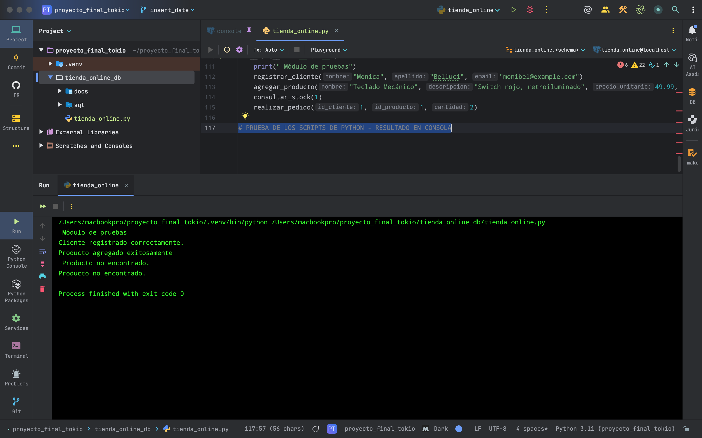

========================================
INTEGRACIÓN CON PYTHON
========================================

Esta sección describe la conexión entre Python y PostgreSQL utilizando la biblioteca `psycopg2`. Se implementaron funciones que permiten ejecutar operaciones CRUD directamente sobre la base de datos `tienda_online`.

Estructura general del script
-----------------------------

El archivo principal `tienda_online.py` contiene funciones para:

- Conectarse a la base de datos mediante credenciales externas (`.env`).
- Registrar clientes y productos.
- Realizar pedidos completos.
- Consultar el stock de productos.

Configuración del entorno
-------------------------

Instalación de dependencias:

.. code-block:: bash

    pip install psycopg2-binary python-dotenv

Archivo `.env` (ejemplo):

.. code-block:: bash

    DB_HOST=localhost
    DB_PORT=5432
    DB_NAME=tienda_online
    DB_USER=admin_tienda
    DB_PASSWORD=admin123

Conexión segura desde Python:

.. code-block:: python

    import psycopg2
    from dotenv import load_dotenv
    import os

    load_dotenv()

    conn = psycopg2.connect(
        host=os.getenv("DB_HOST"),
        port=os.getenv("DB_PORT"),
        dbname=os.getenv("DB_NAME"),
        user=os.getenv("DB_USER"),
        password=os.getenv("DB_PASSWORD")
    )

Funciones implementadas
-----------------------

1. Registrar un cliente:

.. code-block:: python

    def registrar_cliente(nombre, apellido, email):
        cur = conn.cursor()
        cur.execute(
            "INSERT INTO cliente (nombre, apellido, email) VALUES (%s, %s, %s)",
            (nombre, apellido, email)
        )
        conn.commit()
        cur.close()

2. Agregar un producto:

.. code-block:: python

    def agregar_producto(nombre, descripcion, precio, stock, id_categoria, id_proveedor):
        cur = conn.cursor()
        cur.execute(
            "INSERT INTO producto (nombre, descripcion, precio_unitario, stock, id_categoria, id_proveedor) "
            "VALUES (%s, %s, %s, %s, %s, %s)",
            (nombre, descripcion, precio, stock, id_categoria, id_proveedor)
        )
        conn.commit()
        cur.close()

3. Realizar un pedido:

.. code-block:: python

    def realizar_pedido(id_cliente, id_estado, id_producto, cantidad):
        cur = conn.cursor()
        cur.execute("SELECT registrar_pedido(%s, %s, %s, %s)", (id_cliente, id_estado, id_producto, cantidad))
        conn.commit()
        cur.close()

4. Consultar stock:

.. code-block:: python

    def consultar_stock(id_producto):
        cur = conn.cursor()
        cur.execute("SELECT stock FROM producto WHERE id_producto = %s", (id_producto,))
        stock = cur.fetchone()[0]
        cur.close()
        return stock

Validación y pruebas
--------------------

- Se ejecutaron todas las funciones de forma aislada y combinada.
- Se verificó la persistencia de los datos desde PostgreSQL.
- Se controlaron errores como claves duplicadas, restricciones de integridad y conexión fallida.

Esta integración demuestra cómo Python puede actuar como puente entre la aplicación y la base de datos, permitiendo una interfaz programática robusta para gestionar la lógica del negocio.

Resultados en consola
~~~~~~~~~~~~~~~~~~~~~

