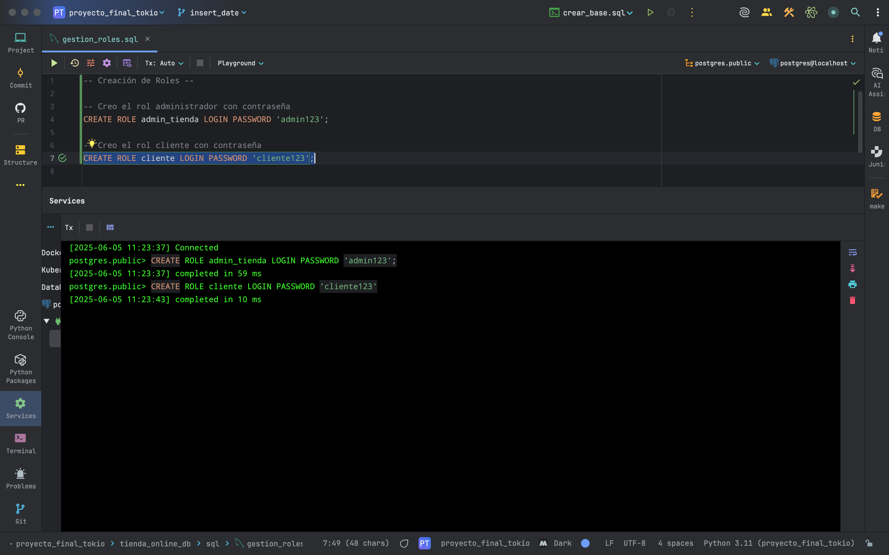
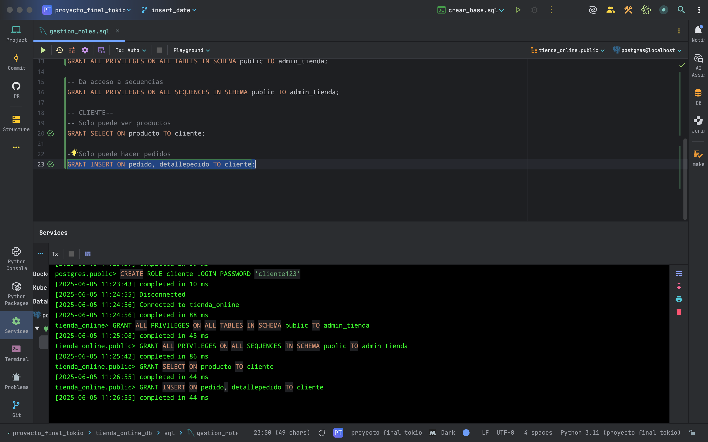
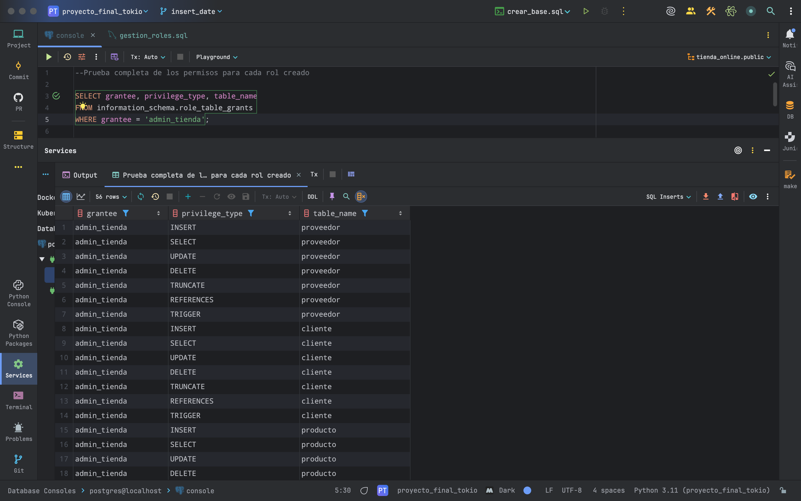

========================================
SEGURIDAD Y GESTIÓN DE ROLES
========================================

En esta sección se describe la configuración de roles y privilegios en PostgreSQL para garantizar el control de acceso a la base de datos `tienda_online`.

Se han creado dos perfiles de usuario:

1. `admin_tienda`: administrador con acceso total.
2. `cliente`: usuario con permisos restringidos.

1. Creación de Roles
--------------------

.. code-block:: postgresql

    CREATE ROLE admin_tienda LOGIN PASSWORD 'admin123';
    CREATE ROLE cliente LOGIN PASSWORD 'cliente123';

Creación de roles
~~~~~~~~~~~~~~~~~

La siguiente imagen muestra la ejecución de los comandos para crear los roles `admin_tienda` y `cliente` con sus respectivas contraseñas:

2. Asignación de Permisos
-------------------------

Permisos para `admin_tienda`:

.. code-block:: postgresql

    GRANT ALL PRIVILEGES ON ALL TABLES IN SCHEMA public TO admin_tienda;
    GRANT ALL PRIVILEGES ON ALL SEQUENCES IN SCHEMA public TO admin_tienda;

Permisos para `cliente` (acceso de solo lectura y registro de pedidos):

.. code-block:: postgresql

    GRANT SELECT ON cliente, producto, categoria, proveedor TO cliente;
    GRANT SELECT, INSERT ON pedido, detallepedido TO cliente;

Asignación de permisos a roles
~~~~~~~~~~~~~~~~~~~~~~~~~~~~~~

Se otorgan todos los permisos al rol `admin_tienda` y permisos limitados al rol `cliente`, quien solo podrá ver productos y realizar pedidos.

3. Revocación explícita de permisos
-----------------------------------

Se ha limitado el acceso de `cliente` para que no pueda modificar ni eliminar registros críticos.

.. code-block:: postgresql

    REVOKE ALL ON ALL TABLES IN SCHEMA public FROM cliente;
    -- Aplicar nuevamente los permisos necesarios:
    GRANT SELECT ON cliente, producto, categoria, proveedor TO cliente;
    GRANT SELECT, INSERT ON pedido, detallepedido TO cliente;

4. Pruebas realizadas
---------------------

- Conexión al sistema con cada usuario para validar privilegios.
- Verificación de errores de acceso denegado en operaciones no autorizadas.
- Prueba de inserción de pedidos como `cliente`.
- Prueba de consultas de productos y stock.

Verificación de permisos del rol `admin_tienda`
~~~~~~~~~~~~~~~~~~~~~~~~~~~~~~~~~~~~~~~~~~~~~~~

Se consultó la vista `information_schema.role_table_grants` para confirmar los permisos aplicados al rol `admin_tienda`.

5. Buenas prácticas aplicadas
-----------------------------

- Separación clara entre usuarios con permisos administrativos y operativos.
- Reglas explícitas de seguridad en SQL, evitando privilegios innecesarios.
- Uso de roles con contraseña encriptada (en entorno real se recomienda cifrado adicional y política de rotación).
- Control de acceso orientado a principios de mínimo privilegio.

Este diseño permite un entorno seguro y escalable, listo para ampliaciones en un sistema multiusuario real.

